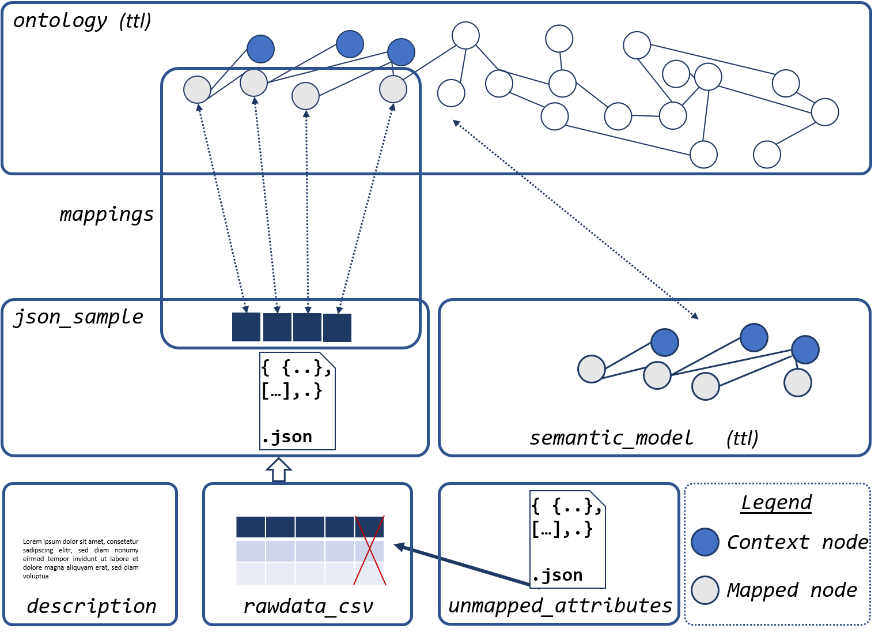

# VC-SLAM - Versatile Corpus for Semantic Labeling And Modeling

The VC-SLAM corpus is a benchmark corpus for semantic labeling and modeling.
It consists of 101 data sets including schema, labels, raw data and descriptions as well as manually created semantic models.

## The Corpus

This section describes the structure of the VC-SLAM corpus

### Overview

To download the actual corpus, please access our [Zenodo repository](https://zenodo.org/record/5782764) and download the zip archive.

The corpus consists of 101 data sets and a target ontology.
A closer description of the 101 data sets, their background and their license can be found in DataSetOverview.xlsx.

The ontology is available in two versions, both in the rdf/turtle format that can be found in the ontology folder:
* ontology.ttl: a basic version of the target ontology
* ontology_dist.ttl: a version of the ontology with distinct object properties

For each of the 101 data sets one file exists in the following folders, having the data set id as prefix:

### rawdata_csv

This folder contains the raw data sets in CSV format as they were acquired from the open data portals.
Only these files will include the maximum number of available data points for each data set.

### rawdata_csv_samples

This folder contains a reduced version of each data set from rawdata_csv

### json_sample_large

This folder contains json/geojson files that were acquired from the data portals additionally to the CSV files or parsed from the CSV files.

### json_sample_small

This folder contains small samples of the json files containing maximum three data points per data source. These samples were used to explore the original data schema using PLASMA.

### csv_json_mappings

This folder contains json files containing the mapping of attribute names from csv files to json files as some attributes / headers can differ in their name.

### descriptions

This folder contains text files including the data set description as well as explanations of the included attributes. Texts and descriptions were copied directly from the data portal websites and thus are unstructured. 

### mappings

This folder contains json files describing the mapping between raw data source and target ontology. Each json file contains a list of mappings for the respective data sets, each coming with the following attributes:

* originalLabel: the attribute name in the json samples
* path: the list of nodes from root to the attribute node, if data is nested, otherwise empty
* concept: the vcslam internal URI for the concept as it can be found in the semantic model

### ignored_attributes

This folder contains json files including a list of the attributes that were not taken into account for modeling of the data set. This is mostly the case when the open data portal enriched the json files with internal identifiers (mostly starting with @)

### semantic_models

This folder contains the semantic models as rdf/turtle files, describing concepts and relations in the model.
All of these models were manually created, using PLASMA and serve as reference models.

* XXXX.ttl: a detailed version of the model enriched with descriptions of concepts and relations

## Statistics
The statistics folder of this repository contains some additional statistics on the VC-SLAM corpus

* single_datasets: A breakdown of all datasets and their associated semantic models and metadata. This amount and types of used concepts and relations, original data set characteristics and meta data characteristics.
* all_datasets: A statistical summary of single_dataset.xlsx
* similarity_matrix: a matrix showing the number of all shared concepts between all models
* concept_usage: All concepts from the ontology, their usage frequency, and mapped original labels
* relation_usage: All relations from the ontology and their usage frequency

## Additional Material

The information folder contains the file data-portal-list.xlsx. This is a summary of data portals taken into account for the VC-SLAM corpus and their characteristics.

## License

The Corpus itself is licensed under the [CC-BY 4.0 License](https://creativecommons.org/licenses/by/4.0)

The individual data sets are licensed by the licenses specified in the attached Excel sheet (DataSetOverview.xlsx)
